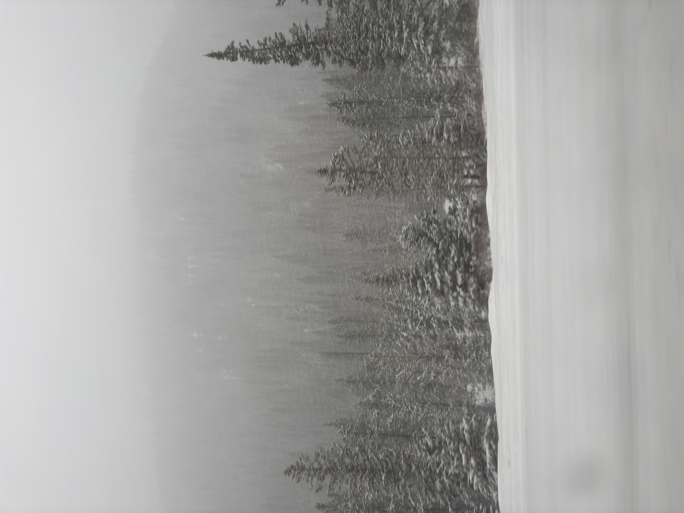

# Error Diffusion Dithering
This project is an experiment with error diffusion dithering, specifically the Atkinson dithering algorithm.

The image before dithering

The result after dithering

## What is Dithering?
Dithering is a way to maintain detail in an image while quantizing it, reducing its color scheme. In this example, I reduced
the color scheme of this image from full color to just pure black and white pixels.

## What is Error Diffusion?
Error diffusion is a method of dithering where you take the error after rounding the pixel to the colorscheme
and spread it to the surrounding pixels.
